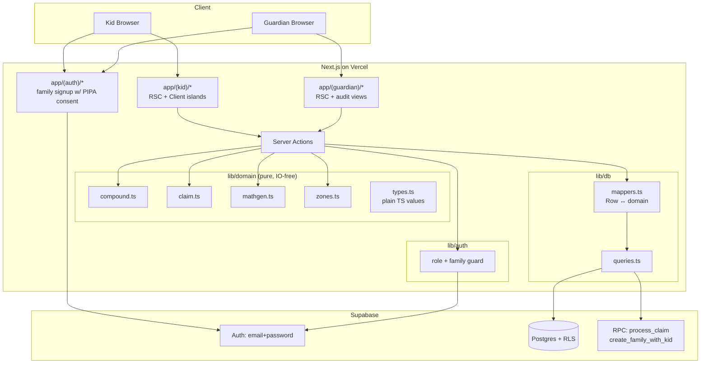
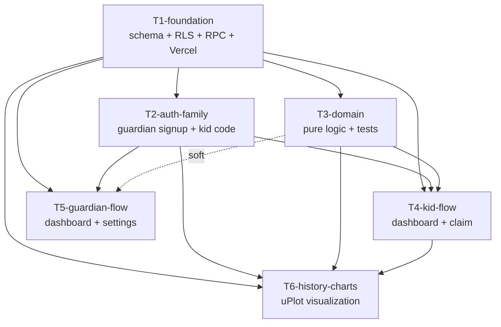

# Compound Learning System — Elementary Tier (MVP) — Spike Plan

> **Brainstorming + Multi-agent review 출처**: 사용자와의 대화에서 합의된 결정 + 5명의 전문가 에이전트 리뷰. 핵심: "시간이 돈을 키운다 (복리) + 너가 청구해야 받는다 (Unlock & Claim)" 두 경험을 7-8주 안에 실제 잔액 변화로 체감시키되, 모든 schema/timezone/security 결정은 이 spike 단계에서 못박는다.

---

## §1 Requirements

### 1.1 Epic Goal

초등학교 5-6학년 자녀가 가족용 웹앱을 통해 **"시간이 돈을 키운다 (복리)"** 와 **"정기적으로 청구해야 받는다 (자본주의의 작동)"** 두 핵심 개념을 7-8주 안에 본인 돈의 실제 2배 성장으로 체감하도록 한다. 초/중/고 3-tier 데이터 모델로 설계하되, **MVP는 초등 고학년 1인 사용 시나리오만** 구현. 결정의 미래 확장성은 schema에 baked-in (cycle_number, age_tier, family multi-tenancy).

### 1.2 Success Criteria

- [ ] **잔액 성장 경험**: 8주차 종료 시 실험영역 잔액 ≥ 시작 자금의 2배 (10,000 → 21,435원, `floor(10000 × 1.10⁸)` step-floored 결과)
- [ ] **주간 의식 지속**: 자녀가 8주 중 **≥ 7주 청구 완수**, **2주 연속 누락 없음** (관측 가능, 자동 측정)
- [ ] **자유 영역 인식**: 자녀가 자유영역(70-80%)에서 통제받지 않는다고 느낌 (자기보고 1회)
- [ ] **누락 주 복원성**: 청구 누락 시 이자 누적, **최대 4주분까지** carry-over. 5주 이상 누락된 이자는 expire (영구 소멸 — 의식의 가치 보존)
- [ ] **즉시 청구 우월성**: 매주 청구 vs 일괄 청구 시 잔액 차이가 그래프로 시각화 (예: 4주 누적 후 청구 시 약 1.4% 손실)
- [ ] **보호자 모니터링**: 보호자가 자녀의 모든 시도/잔액/거래/락아웃을 한 화면에서 확인
- [ ] **설정 가능성**: 보호자가 시작 자금, 매칭 비율, weekly deadline day(요일)를 설정 가능
- [ ] **8주 완주 전환**: 8주 종료 시 completion 화면 표시. 보호자가 (a) reset / (b) extend (이어서 계속) / (c) graduate (보존만, 더 이상 자라지 않음) 선택

### 1.3 Non-Functional Requirements

#### 1.3.1 시간/주 정의 (ADR-006)
- **주 경계**: 월요일 00:00 KST ~ 일요일 23:59 KST. 서버 시간이 권위.
- **KST 하드코딩**: UTC+9, 한국은 DST 없음
- **week_num 공식**: `floor((now_kst - account.epoch_kst) / 7 days)`
- **epoch**: 가족 생성 직후 첫 월요일 00:00 KST로 정렬
- 자녀가 일요일 23:58에 청구 vs 월요일 00:02에 청구는 **다른 주**로 처리. 명확.

#### 1.3.2 SLA
- 가족 1팀 MVP, Vercel + Supabase free tier. 99% uptime 자연스럽게 달성.
- **클리티컬 윈도우**: 매주 일요일 KST 19-21시 (가족 의식 시간) — 이 시간대 outage = 학습 의식 무산. 최우선 모니터링.
- 응답시간: 정적 페이지 p95 < 800ms, 청구 트랜잭션 p95 < 1.5s
- **Supabase auto-pause 방지**: 토요일 23:00 KST keepalive cron 필수 (ADR-001 선택의 trade-off)

#### 1.3.3 Security Threat Model

| 위협 | 방어 |
|---|---|
| 자녀가 부모 계정에 접근해 잔액 조작 | 보호자 화면 별도 PIN (post-MVP) + 행동 로그 audit |
| 자녀가 산수 우회로 이자 청구 | server-side validation, 클라이언트 입력 신뢰 X |
| **산수 brute-force (반복 시도)** | **주당 시도 5회 제한, 초과 시 그 주 청구 락 (자동 다음 주로 carryover)** |
| **세션 공유 (학교 iPad 등)** | **자녀 화면 30분 비활성 자동 logout** |
| 외부 invasion | Supabase RLS row-level 격리. 가족 외부 row 접근 불가 |
| append-only audit 손실 | DB role + trigger 이중 보호 (ADR-005) |
| **service_role bypass** | **Server Actions은 scoped `app_writer` 역할 키 사용. service_role 키는 migration/admin 전용** |

#### 1.3.4 Privacy / Compliance — Korean PIPA Article 22

- 자녀는 만 14세 미만 → 법정대리인(보호자) 명시적 동의 필수
- **명시적 동의 모델**: 보호자 가입 시 동의 체크박스 + 동의 텍스트 + 클릭 timestamp + 동의 버전을 `consents` 테이블 row로 영구 보존, 사용자 요청 시 export 가능
- 자녀 PII 최소화: **닉네임만**. 생일/실명/이메일 X.
- 데이터 잔존: 가족 탈퇴 시 30일 후 cascade delete. 자녀 성년(만 19세) 시 데이터 export 권리.
- 데이터 위치: Supabase ap-northeast-1 (Tokyo) — 한국 region 미존재로 가장 가까운 곳. ToS에 명시.

#### 1.3.5 Accessibility

- WCAG 2.1 AA 목표
- **dyslexia 고려**: 산수 텍스트 ≥ 16px, line-height ≥ 1.5, justified alignment 금지. "read aloud" 기능은 post-MVP.
- 색약: 자유/실험/보너스를 색만이 아닌 아이콘으로도 구분
- 키보드 네비게이션 + 스크린 리더 지원
- CI에 axe-core 자동 검사

### 1.4 Rollout / Rollback Strategy

#### 1.4.1 Stages (변경 없음)
Dev → Vercel Preview (PR) → Prod (main).

#### 1.4.2 Feature Flags
| Flag | Default | 해제 조건 |
|---|---|---|
| `ENABLE_BONUS_ZONE` | true | 안정 운영 3개월 |
| `ENABLE_HISTORY_CHART` | false (T6 머지 후 true) | T6 안정 1개월 |
| `ENABLE_GUARDIAN_PIN` | false | post-MVP |

#### 1.4.3 Migration PR Policy
- **모든 UP migration은 같은 PR에 DOWN SQL 동봉**. 미포함 시 reviewer 거부.
- Path: `supabase/migrations/{ts}_{name}.sql` (UP), `supabase/migrations/{ts}_{name}.down.sql` (DOWN).

#### 1.4.4 Rollback Procedure
| 종류 | 절차 | RTO |
|---|---|---|
| 코드 회귀 | Vercel "Promote previous deployment" | 1 min |
| DB migration 회귀 | `*.down.sql` 적용 (사전 작성) | 5 min |
| 데이터 손상 | 매주 일요일 dump 백업 → 수동 복원 (free tier; PITR은 Pro 필요) | 24h |

#### 1.4.5 Saturday Keepalive Cron
- Vercel Cron: `0 14 * * 6` (UTC = 토 23시 KST)
- `/api/keepalive` 라우트 → `SELECT 1 FROM families LIMIT 1`
- 목적: Supabase free-tier auto-pause 방지 (1주 비활성 시 일시정지)
- 실패 시 즉시 alarm

---

## §2 Architecture + NFR

### 2.1 Component Diagram



### 2.2 Boundary Principles

| 원칙 | 의미 | 강제 메커니즘 |
|---|---|---|
| **순수 도메인** | `lib/domain/` 는 DB/HTTP/시간/random 모름 | `lib/domain/types.ts` 의 plain TS value type만. 시간/random은 인자 주입. eslint custom rule `domain-no-io`: `lib/domain/**` 에서 `@supabase/*`, `next/*`, `fs`, DB types import 금지 (ADR-003) |
| **Typed boundary** | DB Row vs domain value 명시 분리 | `lib/db/mappers.ts` 가 `Database['public']['Tables']['accounts']['Row']` ↔ `ExperimentAccount` 변환. 매퍼 통과 안한 row는 도메인 진입 금지 |
| **얇은 액션** | Server Action = 도메인 호출 + DB 쓰기 | 30 LOC 가이드. **모든 잔액 변화는 단일 Postgres RPC 호출로 batch** (network round-trips 최소화) |
| **RLS = 권한 1차** | 권한을 DB에 위임 | 코드 권한 체크는 UX. 보안 보증은 RLS (ADR-004) |
| **Append-only audit** | `transactions` INSERT만 | (1) `app_writer` role grant: UPDATE/DELETE deny. (2) `BEFORE UPDATE OR DELETE` trigger 이중 보호 (ADR-005) |
| **service_role 격리** | service_role 키는 migration/admin 전용 | Server Actions은 `SUPABASE_APP_DB_URL` (`app_writer` credentials) 사용. service_role 키 직접 사용 시 lint 오류 |

### 2.3 NFR Enforcement Points

| NFR | 강제 지점 |
|---|---|
| SLA 99% | Vercel Analytics + Supabase health + Saturday keepalive cron + Sunday 19시 ping bot (§4.6) |
| Privacy (PIPA) | `consents` 테이블 강제. RLS 정책 단위테스트 |
| Append-only | DB role + trigger (ADR-005) |
| 정수 정확성 | BIGINT schema (ADR-002) + property test |
| Domain purity | eslint rule `domain-no-io` |
| A11Y | CI에 axe-core |
| Rate limit | `claim_attempts.attempt_number_this_week` ≤ 5, 초과 시 lockout |

### 2.4 ADRs (Architectural Decision Records)

`docs/adr/` 에 별도 파일로 보관. 모두 spike에서 결정 완료.

| ID | 제목 |
|---|---|
| ADR-001 | Tech Stack — Next.js + Supabase + Vercel |
| ADR-002 | Monetary as BIGINT KRW Integer |
| ADR-003 | Domain Purity with Typed Boundary |
| ADR-004 | RLS as Primary Permission |
| ADR-005 | Append-Only Transactions, Defense in Depth |
| ADR-006 | Weekly Tick + KST Timezone |
| ADR-007 | Balance Cache Reconciliation — Claim-Time Atomic Write |

---

## §3 Rollout / Rollback Plan

### 3.1 Stages

| 단계 | 대상 | 게이트 |
|---|---|---|
| Dev | localhost + Supabase dev project | unit test pass |
| Preview | Vercel preview URL on PR | E2E pass (Playwright) + RLS test pass |
| Prod | Vercel main + Supabase prod | 보호자 1회 검토 |

### 3.2 Feature Flags
(§1.4.2 참조)

### 3.3 Rollback Procedure
(§1.4.4 참조)

### 3.4 Migration PR Policy
(§1.4.3 참조 — UP/DOWN SQL 동시 PR 강제)

### 3.5 Saturday Keepalive
(§1.4.5 참조 — auto-pause 방지)

### 3.6 Post-launch Cleanup
- 안정 운영 3개월 후: `ENABLE_BONUS_ZONE`, `ENABLE_HISTORY_CHART` 환경변수 제거, default-on 코드로 단순화
- 사용 안 하는 FF는 코드에서 즉시 제거 (FF 고립 방지)

---

## §4 Observability Plan

### 4.1 Metrics

| Metric | Type | Unit | 의미 |
|---|---|---|---|
| `claim.attempted_total` | counter | count | 청구 시도 (성공/실패 무관) |
| `claim.succeeded_total` | counter | count | 정답 → 잔액 갱신 성공 |
| `claim.duration_seconds` | histogram | s | 청구 클릭 → 잔액 반영 시간 |
| `experiment_balance_krw` | gauge per family | KRW | 실험영역 잔액 |
| `weekly_growth_pct_base` | gauge per family | % | bonus 제외 순수 성장률 (반드시 정확히 10) |
| `weekly_growth_pct_with_bonus` | gauge per family | % | bonus 포함 effective 성장률 |
| `mathgen.failure_total` | counter | count | 산수 문제 생성 실패 (의식 차단 위험) |
| `guardian.dashboard_load_error_total` | counter | count | 보호자 화면 로드 실패 |
| `brute_force_lockout_total` | counter | count | 산수 5회 초과로 그 주 락 |
| `keepalive.success_total` | counter | count | 토요일 keepalive cron 성공 |
| `rls_denied_expected_total` | counter | count | 정상 거부 (예: 미래 주 조회) |
| `rls_denied_suspicious_total` | counter | count | 비정상 거부 (cross-family 시도) |

### 4.2 Logs (구조화)

모든 Server Action은 다음 fields:

```json
{
  "ts": "ISO-8601",
  "request_id": "uuid",
  "family_id_hash": "sha256[:8]",
  "actor_role": "kid|guardian",
  "action": "string",
  "account_id": "uuid?",
  "week_num": "int?",
  "amount": "bigint?",
  "success": true,
  "error_code": "string?",
  "problem_id": "uuid?",
  "answer_correct": "boolean?",
  "attempt_number_this_week": "int?"
}
```

- `family_id_hash` (raw 아님) — pseudonymous PII 보호
- `request_id`는 Server Action 시작 시 생성, `SET LOCAL app.request_id = '...'` 로 Postgres 세션에 주입 → Vercel ↔ Supabase 로그 cross-correlation 가능

### 4.3 Traces

- Vercel Analytics 자동 trace + 위 `request_id` correlation
- 별도 OTel 도입은 over-engineering (단일 가족 규모)

### 4.4 Dashboards

- Vercel Analytics 대시보드
- Supabase Logs Explorer
- **Axiom 무료 티어** (90일 retention) — Vercel(1d) / Supabase(7d) retention 한계 보완. Next.js logger 통합 패키지 사용

### 4.5 Alerts

| 조건 | 액션 | 근거 |
|---|---|---|
| 5xx ≥ 3 in any 10-min rolling window during 19-21 KST 일요일 | 보호자 이메일 (Resend) | 단일 가족 traffic 특성상 percentage-based 무의미, count-based가 정확 |
| `weekly_growth_pct_base` ≠ 정확히 10 | 즉시 alarm | 도메인 계산 버그 = 학습 메시지 파괴 |
| `rls_denied_suspicious_total` ≥ 1 | 보안 alarm | cross-family 시도는 항상 비정상 |
| `rls_denied_expected_total` (미래 주 등) | 로그만, alarm 없음 | 정상 호기심 행동 |
| `mathgen.failure_total` ≥ 1 / hour | 즉시 alarm | 산수 안나오면 청구 자체 불가 |
| `keepalive` 실패 | 즉시 alarm | 일요일 의식 위험 |

### 4.6 Sunday Ping Bot 명세

- **GitHub Actions schedule**: `cron: '0 10,11,12 * * 0'` (UTC 10/11/12시 = KST 19/20/21시 일요일)
- **Endpoint**: `/api/health` — DB SELECT 1 + math problem 생성 가능 확인 + RLS 정책 적용 확인
- **실패 시**: `repository_dispatch` event → Resend 이메일 트리거
- **자기 모니터링**: GitHub Actions 자체 cron 실패 알림 활성화 (cron-failures email)
- **Endpoint 권한**: header `X-Health-Token`로 인증, 토큰은 `HEALTH_PING_TOKEN` 환경변수

---

## §5 API Contracts

API 표면은 **Next.js Server Actions** + 일부 **Postgres RPC**. 외부 REST/GraphQL 없음. **버전 관리/breaking change 정책 N/A** (단일 클라이언트).

### 5.1 Server Action 시그니처

```typescript
// app/(auth)/family/actions.ts
async function createFamily(input: {
  guardianEmail: string;
  guardianPassword: string;
  consentText: string;          // PIPA evidence (full text shown to user)
  consentVersion: string;       // 'v1', 'v2' ...
  kidNickname: string;
  kidGrade: 5 | 6;
  startingCapital: number;      // KRW, BIGINT-safe
}): Promise<
  | { ok: true; familyId: string; kidAccountId: string }
  | { ok: false; reason: 'email_taken' | 'invalid_consent' | 'invalid_input' }
>;

// app/(kid)/dashboard/actions.ts
async function getCurrentMathProblem(input: {
  accountId: string;
}): Promise<
  | { problemId: string; question: string; choices?: string[]; attemptsRemaining: number }
  | null  // already claimed this week
>;

// app/(kid)/claim/actions.ts
async function attemptClaim(input: {
  accountId: string;
  weekNum: number;
  problemId: string;            // server-issued, prevents replay
  userAnswer: string;
}): Promise<
  | { ok: true; newExperimentBalance: number; growthThisWeek: number; pendingClaimsRemaining: number }
  | { ok: false; reason:
      | 'wrong_answer'
      | 'already_claimed'
      | 'not_yet_unlockable'
      | 'attempts_exhausted'   // 5회 초과 lockout
      | 'expired_pending'      // 5주 이상 누락된 이자
      | 'invalid_problem_id'   // replay 방지
    }
>;

// app/(guardian)/settings/actions.ts
async function updateAccountSettings(input: {
  accountId: string;
  startingCapital?: number;             // KRW
  weeklyGrowthRateBp?: number;          // basis points: 1000 = 10.00%
  bonusMatchRateBp?: number;            // 0-10000
  weeklyDeadlineDayOfWeek?: 0|1|2|3|4|5|6;  // 0=Sun ... 6=Sat
}): Promise<{ ok: boolean }>;

// app/(kid|guardian)/end-of-cycle/actions.ts
async function chooseCycleEndAction(input: {
  accountId: string;
  cycleNumber: number;
  action: 'reset' | 'extend' | 'graduate';
}): Promise<{ ok: boolean }>;
```

### 5.2 Postgres RPC

| RPC | 의미 |
|---|---|
| `process_claim(account_id, week_num, problem_id, user_answer)` | atomic: validate + INSERT transactions + UPDATE accounts (cached balance) + INSERT claim_attempts + INSERT weekly_snapshots, 단일 Postgres transaction. 1 round-trip. |
| `create_family_with_kid(...)` | atomic: INSERT families + INSERT memberships (guardian) + INSERT consents + INSERT memberships (kid) + INSERT accounts. 1 round-trip. |
| `reconcile_balance(account_id)` | 점검: SUM(transactions) per zone vs cached balance. 미일치 시 alert (월간 cron). |

---

## §6 Data Migration Chain

| # | 변경 | Owner | Reversible | 핵심 |
|---|---|---|---|---|
| 001 | `families` (UUID id, name) | T1 | yes | - |
| 002 | `memberships` (auth.users → families, role enum, age_tier, grade, display_name) | T1 | yes | - |
| 003 | `consents` (PIPA evidence: family_id, consent_text, consent_version, accepted_at, accepted_by_user_id) | T1 | yes | - |
| 004 | `accounts` — 모든 KRW 컬럼 **BIGINT**: `starting_capital`, `free_balance`, `experiment_balance`, `bonus_balance`, `pending_interest`. 추가 컬럼: `cycle_number INT NOT NULL DEFAULT 1`, `epoch_kst TIMESTAMPTZ NOT NULL`, `weekly_growth_rate_bp INT DEFAULT 1000`, `bonus_match_rate_bp INT DEFAULT 2000`, `weekly_deadline_dow SMALLINT DEFAULT 0`, `cycle_status TEXT CHECK ('active','graduated','reset')` | T1 | yes | - |
| 005 | `transactions` — append-only, **BIGINT amount**, `transaction_type` enum (`initial_deposit`, `free_withdraw`, `free_to_experiment`, `experiment_to_free`, `interest_accrued`, `interest_claimed`, `bonus_match`, `bonus_match_revert`, `manual_adjustment`), **`reverses_transaction_id UUID NULL REFERENCES transactions(id)`** | T1 | yes | - |
| 006 | `claim_attempts` — `problem_id`, `user_answer`, `is_correct`, `attempt_number_this_week INT`, `is_locked_out BOOLEAN` | T1 | yes | - |
| 007 | `weekly_snapshots` — INSERT만, `process_claim` RPC 안에서 같은 Postgres tx 안에 함께 INSERT (ADR-007) | T1 | yes | - |
| 008 | RLS enable + USING/WITH CHECK 정책: 가족 단위 격리. JOIN path: `auth.uid() → memberships → family_id`. 모든 테이블 정책 inline 명시 | T1 | yes | - |
| 009 | DB role `app_writer` 생성. `transactions` INSERT만 GRANT, UPDATE/DELETE REVOKE. `BEFORE UPDATE OR DELETE` trigger 추가 (이중 보호) | T1 | yes | - |
| 010 | RPC 정의: `process_claim`, `create_family_with_kid`, `reconcile_balance` | T1 | yes | - |
| 011 | seed: dev 가족 + 자녀 (development only) | T2 | yes | dev only |

### 6.1 RLS 정책 핵심 (T1 구현 명세)

```sql
-- accounts: kid sees own; guardian sees all family members'
CREATE POLICY accounts_select ON accounts FOR SELECT USING (
  EXISTS (
    SELECT 1 FROM memberships m1
    WHERE m1.user_id = auth.uid()
      AND m1.family_id = (
        SELECT m2.family_id FROM memberships m2
        WHERE m2.id = accounts.membership_id
      )
  )
);

-- transactions: same pattern, account_id → membership → family
CREATE POLICY transactions_select ON transactions FOR SELECT USING (
  account_id IN (
    SELECT a.id FROM accounts a
    JOIN memberships m ON a.membership_id = m.id
    WHERE m.family_id = (
      SELECT family_id FROM memberships WHERE user_id = auth.uid()
    )
  )
);
```

(전체 정책은 T1 ref doc + migration 008에서 완성)

### 6.2 Append-only Trigger (T1 구현 명세)

```sql
CREATE OR REPLACE FUNCTION transactions_immutable()
RETURNS TRIGGER AS $$
BEGIN
  RAISE EXCEPTION 'transactions is append-only (ADR-005)';
END;
$$ LANGUAGE plpgsql;

CREATE TRIGGER transactions_no_update_or_delete
BEFORE UPDATE OR DELETE ON transactions
FOR EACH ROW EXECUTE FUNCTION transactions_immutable();
```

---

## §7 Tickets

<!-- BEGIN AUTO-GENERATED REGISTRY -->
| ID | Title | Status | impl-blockedBy | deploy-blockedBy | Ref |
|----|-------|--------|----------------|------------------|-----|
| T1-foundation | Project skeleton + Schema + RLS + Vercel preview | planned | — | — | [T1-foundation.md](T1-foundation.md) |
| T2-auth-family | Auth + Family creation + PIPA consent + Kid code login | planned | T1 (hard) | T1 (hard) | [T2-auth-family.md](T2-auth-family.md) |
| T3-domain | Pure domain logic (compound, claim, mathgen, zones) | planned | T1 (hard) | T1 (hard) | [T3-domain.md](T3-domain.md) |
| T4-kid-flow | Kid dashboard + weekly claim flow | planned | T1, T2, T3 (hard) | T1, T2 (hard) | [T4-kid-flow.md](T4-kid-flow.md) |
| T5-guardian-flow | Guardian dashboard + audit + settings + cycle mgmt | planned | T1, T2 (hard); T3 (soft) | T1, T2 (hard) | [T5-guardian-flow.md](T5-guardian-flow.md) |
| T6-history-charts | Weekly growth visualization (uPlot) | planned | T1, T2, T3, T4 (hard) | T1, T4 (hard) | [T6-history-charts.md](T6-history-charts.md) |
<!-- END AUTO-GENERATED REGISTRY -->

### §7.1 Dependency Graph



### §7.2 Implementation Order (one developer)

```
T1 (foundation, ~1 week) → T3 (domain, parallel candidate) → T2 (auth) → T4 (kid) ∥ T5 (guardian) → T6 (charts)
```

T3 는 T1 직후 시작 가능 (T2 와 병렬). T4 와 T5 는 서로 병렬. T6 는 마지막.

### §7.3 Acyclicity Verification

DFS over `implBlockedBy`: 모든 edge 가 T1 → 다른 ticket 또는 T<n> → T<m> (n<m). **No cycles.** ✓

### §7.4 Deploy Order

`deployBlockedBy` 만 본 deploy chain:
```
T1 (deploys schema + RPC + cron infra)
  → T2 (deploys auth + family creation)
  → T3 (no separate deploy — bundled with consumers)
  → T4 (deploys kid UI; depends on T2 deployed)
  → T5 (deploys guardian UI; depends on T2 deployed)
  → T6 (deploys charts; depends on T4 having data flow)
```

---

## §8 Testing Strategy

### 8.1 Test Pyramid

| Layer | 비중 | 도구 |
|---|---|---|
| Unit (`lib/domain/`) | **65%** | Vitest + fast-check (property tests) |
| Integration (Server Actions + DB + RLS) | **20%** | Vitest + Supabase test client |
| E2E (Playwright) | **10%** | Playwright + clock injection |
| Migration / Smoke | **5%** | psql + custom scripts |

### 8.2 Coverage Targets

| Surface | Target |
|---|---|
| `lib/domain/**` | ≥ 90% branch (Vitest + c8) |
| RLS policies | 100% policy×operation matrix exercised (binary deny/allow) |
| UI components | ≥ 70% (smoke + E2E) |
| Server Actions | ≥ 80% (integration) |

### 8.3 Critical Test Items (16개)

#### 8.3.1 Unit (lib/domain) — 6개
1. `applyWeeklyInterest(b, 1000bp)` returns `floor(b * 1.10)` — 10000→11000, 21436→23579
2. Boundary: 0, negative (defensive throw), max BIGINT 안전성
3. Multi-week catch-up semantics: `f^N(b)` 결과 + `floor` 적용 시점 명시 + 1.10⁸ → 21435 정확
4. **Property test (fast-check)**: `applyWeeklyInterest` 결과 ∈ `[b, b * 1.10 + 1]`, non-decreasing, deterministic
5. `generateProblem`: 같은 문제 연속 안나옴, 난이도 단조 증가 (1주차 < 8주차)
6. `canClaim`: `already_claimed`, `not_yet_unlockable`, `expired_pending` 분기 정확

#### 8.3.2 RLS — 3개
7. user_A (family 1) JWT로 `SELECT * FROM accounts WHERE id = <family_2_account>` → 0 rows. 모든 테이블 반복 (families, memberships, accounts, transactions, claim_attempts, weekly_snapshots, consents).
8. `app_writer` role로 `UPDATE transactions` / `DELETE transactions` → `42501 insufficient_privilege` 또는 trigger exception
9. service_role 키 직접 사용 금지 — server actions 코드에 `SUPABASE_SERVICE_ROLE_KEY` 임포트 시 lint fail

#### 8.3.3 Integration — 3개
10. `attemptClaim` (정답): 단일 Postgres tx 안에 transactions INSERT + accounts UPDATE + claim_attempts INSERT + weekly_snapshots INSERT 모두 존재. 동일 weekNum 재호출 시 `already_claimed`.
11. `attemptClaim` (cross-family JWT): 5xx 아니라 `{ ok: false, reason: 'invalid_input' }` 반환. transactions row 미생성.
12. `createFamily` (consent 누락): 실패. transactions/accounts 미생성 (atomic).

#### 8.3.4 E2E (Playwright + clock injection) — 3개
13. **Golden path**: 보호자 가입 + PIPA consent → 자녀 계정 (10000원) → clock 1주 진행 → 자녀 청구 → balance 11000원 표시
14. **Brute-force**: 자녀 5회 오답 → 5번째에 lockout 메시지 → 그 주 청구 불가, 다음 주에 carryover
15. **Skip-and-catch**: clock 4주 진행 → 자녀 한 번에 청구 → 4주분 누적 이자가 한번에 반영, 그래프에 "즉시 청구 우월성" 영역 음영 표시. **Skip 5주**: expired_pending 표시, 1주분 이자 영구 소멸.

#### 8.3.5 Migration / Smoke — 1개
16. 011 마이그레이션 각각: UP 적용 → schema diff 확인 → DOWN 적용 → schema diff = 0. CI에서 자동 검증.

### 8.4 PIPA 동의 테스트
- `createFamily` 호출 시 `consentText`/`consentVersion` 누락 → fail
- 성공 시 `consents` 테이블에 row 존재 + 텍스트/버전/timestamp 일치 + export 가능

### 8.5 Reconciliation Test
- 매월 cron `reconcile_balance` 실행 → SUM(transactions) per zone == cached balance. 미일치 시 alert.

---

## 변경 로그

- **2026-04-25 v1**: 초안 작성 (brainstorming 결과 반영)
- **2026-04-25 v2**: Multi-agent consensus review (5 agents). 17 must-fix items 반영, 2 ADR 신규 (006, 007), §1.3 PIPA 명시, §4 observability 대폭 보강, §6 schema BIGINT 화 + cycle_number + reverses_transaction_id, §8 신규 작성.
